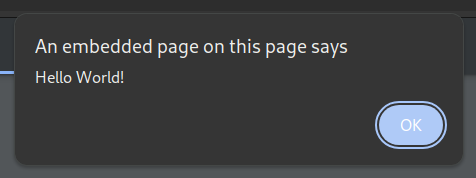

## js2pdf

Really simple Python script for injecting JavaScript into a PDF. The JavaScript should run in most viewers/browsers when the PDF is opened.

#### Requires PyPDF2: ``pip install pypdf2``

```
usage: script.py path/to/pdf.pdf path/to/javascript.js
options:
  -o    to specify a different output file (example: -o path/to/output.pdf)
  -O    to overwrite the input PDF (by default, the new PDF is named using the old filename prefixed with "new_")
```

### Example

```
[will@will]$ python3 js2pdf.py document.pdf payload.js
Successfully injected payload.js into document.pdf. Output file: new_document.pdf
```

If the content of your JavaScript file is ``app.alert("Hello World!");`` then an alert showing "Hello World!" will appear when viewing the PDF (in this example, in Chrome).




